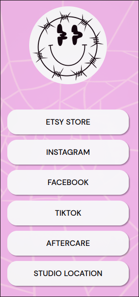
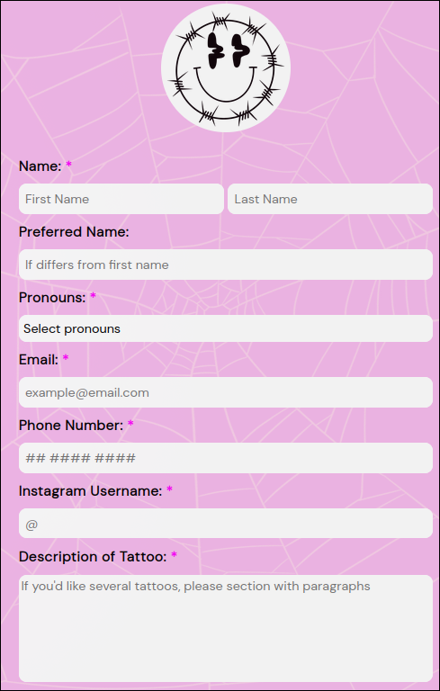

# Georgia Tattoos - Website

  
   
  
   
  <em>↑ Click to go to website ↑</em>
   
   
  
Welcome to the official website of <a href="http://www.georgiatattoos.com.au"><strong>Georgia Tattoos</strong></a>, a Brisbane-based tattoo artist renowned for her vibrant color work, neo-traditional, and traditional tattoo styles.
 

## Created using

- 
- 
- 
- 

## Tools Used

- 
- 
- 
- 
- 
- 
- 

## Screenshots

<h3>Homepage</h3>

<h3>Booking</h3>

  

<h3>Created & Maintained by <a href="https://github.com/Klon3r">Klon3r</a></h3>

