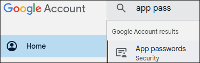
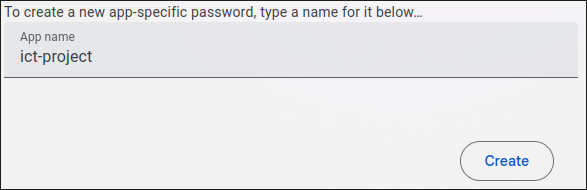
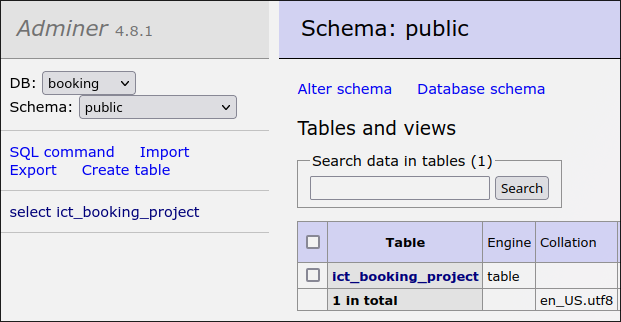
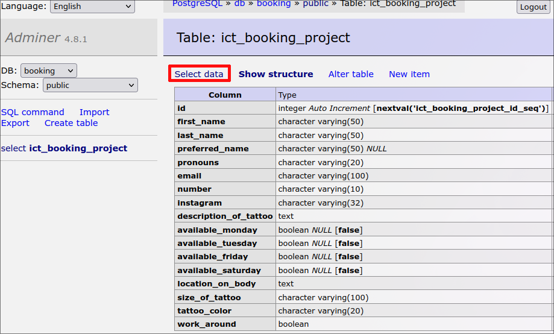
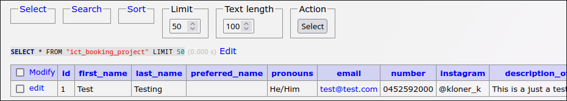
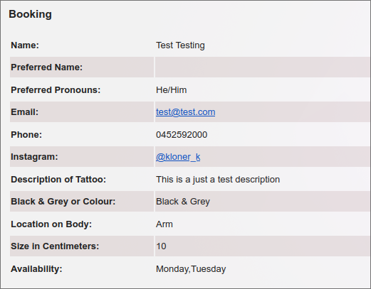

# ICT 342: Georgia Tattoos Booking Website

This is my project for my client 'Georgia'. Below you will have to follow the steps to get the local website up and running

I have split the project into two branches, this on being `university` and the live website one being `main`.

# How to Run

Please follow the steps below to get the project working on your local machine

## Must Have!

- [NodeJS & NPM](https://nodejs.org/en)
- [Docker](https://www.docker.com/)

## Adding .env file

We need to create a .env file to store all your sensitive information (This will not be seen by anyone)

- create `.env` in the root directory of project (`georgia-tattos/.env`)

#### Postgress Information

- Paste the following into the .env file

```
POSTGRES_USER=user
POSTGRES_PASSWORD=password
POSTGRES_DB=booking
DATABASE=booking
HOST=127.0.0.1
PORT=5432
```

#### Email Information (Gmail)

- Paste the following into the .env file
- Change the `EMAIL_USERNAME` with your email address (This is needed since it will send you an email once the booking is submitted)

```
EMAIL_HOST=smtp.gmail.com
EMAIL_PORT=587
EMAIL_USERNAME=
EMAIL_PASSWORD=
```

##### Email Password aka App Password

- Go to [myaccount](https://myaccount.google.com/)
- You must have two factor authentication on your google account
- Search for App Password in search box

  

- Create a new passcode as seen below

  

- Copy the generated app password into `EMAIL_PASSWORD` & remove the spaces

Now the .env file is finished we can move on to running the project.

## Website via Vite

- Git Clone HTTPS: `git clone https://github.com/Klon3r/georgia-tattoos.git`
- or Git Clone SSH: `git clone git@github.com:Klon3r/georgia-tattoos.git`
- Change to University Branch: `git checkout university`
- Install NPM Dependencies: `npm i`
- Run Vite: `npm run dev`
- Goto: http://localhost:5173

## Node Server

- Run Node Server: `npm run server`

## Docker

- Open Docker
- Run Command: `npm run docker`

# Submitting a Booking

- Visit: `http://localhost:5173/`
- Click on Booking
- Enter details
- Click Submit

## Viewing Database

- Adminer (Database Viewer): `https://localhost:8080`

Adminer Info

- System: `PostgreSQL`
- Server: `db`
- Username: `user`
- Password: `password`
- Database: `booking`

- Click ict_booking_project



- Click Select Data



- View the data you just submitted



- The booking should also have been sent to your email that you set up


