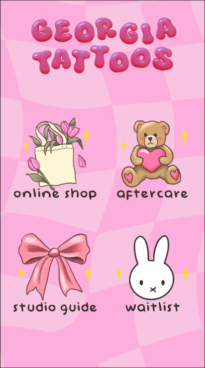
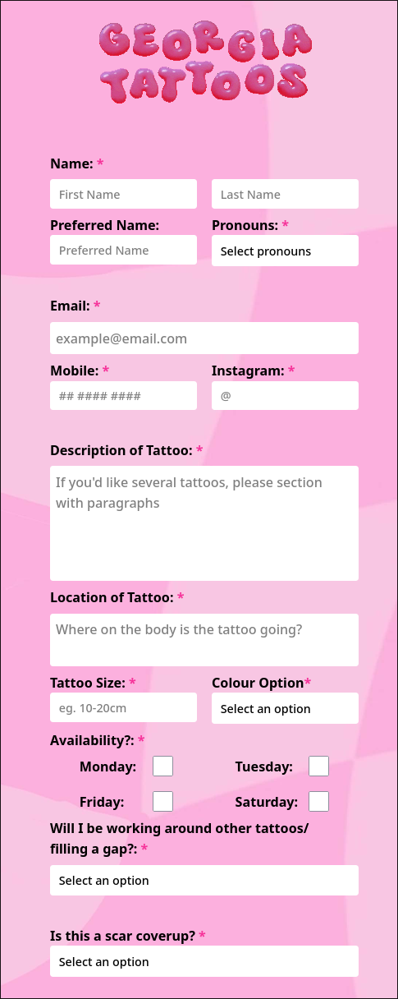
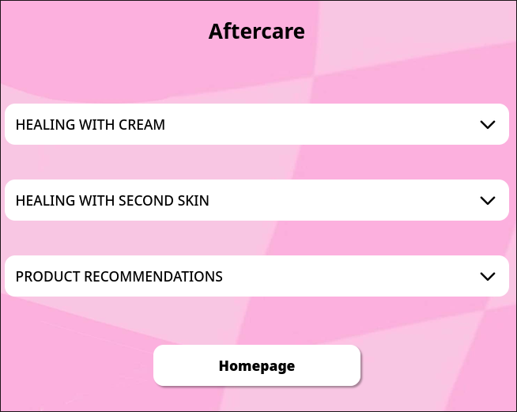

# Georgia Tattoos - Website

  
   
  
   
  <em><a href="http://www.georgiatattoos.com.au">Click here to go to website</a></em>
   
   
  
Welcome to the official website of <a href="http://www.georgiatattoos.com.au"><strong>Georgia Tattoos</strong></a>, a Brisbane-based tattoo artist renowned for her vibrant color work, neo-traditional, and traditional tattoo styles.
 

# Contents

### Booking Form

A hand built booking form using custom components

- **Front End:** React + Tailwind CSS
- **Back End:** Serverless NodeJS via Vercel
- **Storage:** Blob via Vercel (user uploaded images)

**user flow**

- User fills their information into the booking form
- User uploads photos which get stored into a Vercel Blob Storage
- Once submitted data gets sent to the backend parsed and sent to Resend (Email API)
- Users booking information gets sent to Georgia's email where they correspond with each other.

### Aftercare

A tattoo aftercare guide with attached photos of products

## Screenshots

#### Homepage

#### Booking Form

#### Aftercare

## Created using

- 
- 
- 
- 
- 
- 
- 
- 

<h3>Created & Maintained by <a href="https://github.com/keiranbun">Keiran</a></h3>

